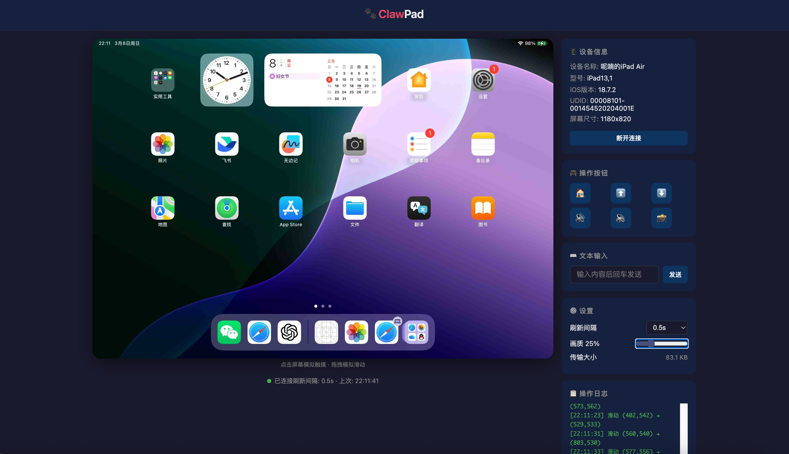
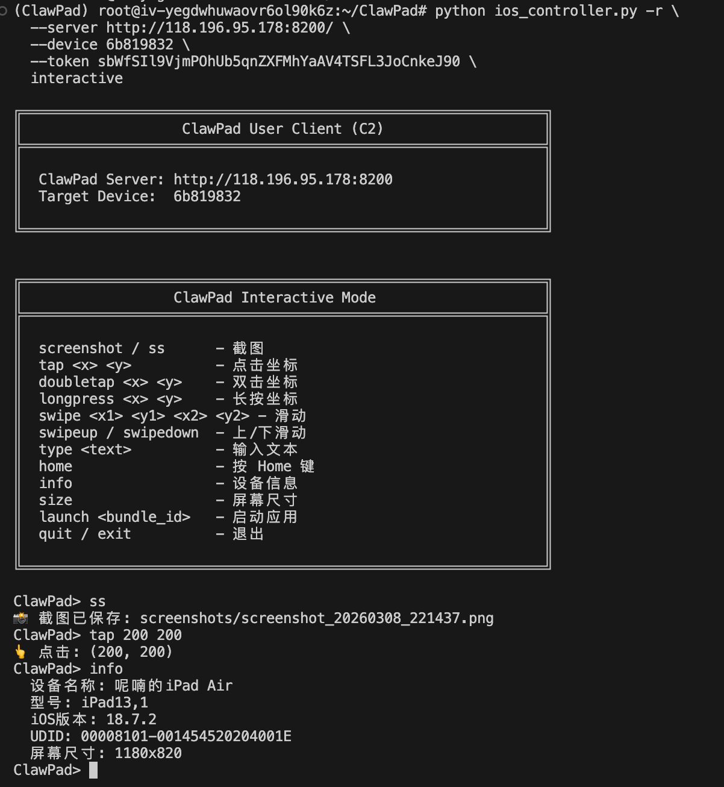

# ClawPad - iOS 设备控制器

在 macOS 上通过 USB 连接 iOS 设备（iPhone / iPad），实现 **截图** 和 **模拟点击/滑动** 等操作。支持 **本地直连** 和 **C1-S-C2 远程转发** 两种模式。

操作控制方式上，可以通过web界面直接进行操作，也可以使用命令行进行操作



<!-- 
   ClawPad 示例图片2
   展示 ClawPad 应用的第二个使用示例截图。
   图片设置为响应式布局，最大宽度为100%，高度自适应。
-->


## 架构

### 直连模式

```
Mac (Python) ──USB──▶ iOS 设备 (WebDriverAgent)
                       │
                tidevice 管理连接
                facebook-wda 发送指令
```

### 远程转发模式 (C1-S-C2)

```
┌──────────────┐    WebSocket     ┌──────────────┐    HTTP + Token    ┌──────────────┐
│  C1 设备端    │ ═══════════════> │  S 服务器     │ <═══════════════  │  C2 控制端    │
│              │                  │              │                   │              │
│ 连接 iOS 设备 │  注册设备         │ 转发指令      │  发送控制指令      │ 发送指令       │
│ 执行本地操作   │  返回结果         │ 管理鉴权      │  携带 Token       │ 接收结果       │
└──────────────┘                  └──────────────┘                   └──────────────┘
  device_client.py                  server.py                     ios_controller.py -r
```

- **C1（设备端）** — 物理连接 iOS 设备的机器，通过 WebSocket 注册到 Server
- **S（服务器）** — 中心转发服务器，管理设备注册、鉴权、指令转发
- **C2（控制端）** — 任意可访问 Server 的机器，通过 HTTP + Token 发送控制指令

**鉴权流程：**
1. C1 注册设备 → Server 生成 `device_id` + `token` 返回给 C1
2. C1 终端打印凭证，用户将其提供给 C2
3. C2 的所有请求带 `Authorization: Bearer <token>`，Server 校验后转发给 C1

## 文件结构

| 文件 | 说明 |
|------|------|
| `ios_controller.py` | 核心控制器 + CLI 入口（直连/C2 远程/启动 Server/注册设备）|
| `server.py` | 中心转发服务器 (S)，FastAPI + WebSocket |
| `device_client.py` | 设备端客户端 (C1)，WebSocket 连接 Server |
| `static/index.html` | Web 控制台前端页面 |
| `requirements.txt` | Python 依赖 |

核心依赖：
- **[tidevice](https://github.com/alibaba/taobao-iphone-device)** — 阿里巴巴开源工具，用于与 iOS 设备通信、启动 WDA
- **[facebook-wda](https://github.com/openatx/facebook-wda)** — WebDriverAgent 的 Python 客户端，实现截图/点击/滑动
- **[WebDriverAgent](https://github.com/appium/WebDriverAgent)** — Facebook 开源的 iOS 自动化测试框架，运行在设备上
- **[FastAPI](https://fastapi.tiangolo.com/)** — Server 端 HTTP + WebSocket 框架
- **[websockets](https://websockets.readthedocs.io/)** — C1 端 WebSocket 客户端

## 前置条件

### 1. 安装 Python 环境依赖

```bash
pip install -r requirements.txt
```

### 2. 安装 WebDriverAgent 到 iOS 设备

WDA 需要通过 Xcode 编译并安装到设备上，这是**最关键的一步**：

1. **安装 Xcode**（从 App Store）

2. **克隆 WebDriverAgent**：
   ```bash
   git clone https://github.com/appium/WebDriverAgent.git
   cd WebDriverAgent
   ```

3. **用 Xcode 打开项目**：
   ```bash
   open WebDriverAgent.xcodeproj
   ```

4. **配置签名**：
   - 在 Xcode 中选择 `WebDriverAgentRunner` target
   - 在 "Signing & Capabilities" 中设置你的 Apple Developer Team
   - 修改 Bundle Identifier 为唯一值，比如 `com.yourname.WebDriverAgentRunner`

5. **编译安装到设备**：
   - 连接 iOS 设备，在 Xcode 上方选择你的设备
   - 选择 `WebDriverAgentRunner` scheme
   - 点击 `Product` → `Test` 或按 `Cmd+U`

6. **信任开发者**（首次安装时）：
   - 在 iOS 设备上进入 `设置` → `通用` → `VPN与设备管理`
   - 找到你的开发者证书，点击「信任」

> **提示**：如果没有付费开发者账号，可以使用免费的 Apple ID，但需要每 7 天重新签名一次。

### 3. 确认 WDA Bundle ID

安装完成后，确保脚本中的 `WDA_BUNDLE_ID` 与你安装的一致：

```python
WDA_BUNDLE_ID = "com.facebook.WebDriverAgentRunner.xctrunner"
```

如果你修改了 Bundle ID，请同步修改脚本中的值。

## 使用方法

### 一、直连模式（本地 USB）

直接通过 USB 连接设备操作，无需 Server。

```bash
# 列出已连接的设备
python ios_controller.py list

# 截图（自动保存到 ./screenshots/）
python ios_controller.py screenshot

# 截图并指定保存路径
python ios_controller.py screenshot -o my_shot.png

# 点击坐标 (200, 300)
python ios_controller.py tap 200 300

# 滑动：从 (100,500) 滑到 (100,200)
python ios_controller.py swipe 100 500 100 200

# 启动 Safari
python ios_controller.py launch com.apple.mobilesafari

# 进入交互模式
python ios_controller.py interactive
```

### 二、远程转发模式（C1-S-C2）

适用于设备和控制端不在同一台机器的场景。

#### Step 1：启动 Server (S)

在任意可被 C1 和 C2 访问的机器上运行：

```bash
python server.py
# 或
python ios_controller.py serve
# 自定义端口
python server.py --host 0.0.0.0 --port 8200
```

启动后可访问 `http://<IP>:8200/docs` 查看 Swagger API 文档。

#### Step 2：注册设备 (C1)

在连接了 iOS 设备的机器上运行：

```bash
python device_client.py --server http://<server-ip>:8200
# 或
python ios_controller.py register --server http://<server-ip>:8200
# 指定设备
python device_client.py --server http://<server-ip>:8200 -u <UDID>
```

注册成功后会打印：
```
╔═══════════════════════════════════════════╗
║  🎉 设备注册成功！                        ║
║  设备 ID :  a1b2c3d4                      ║
║  Token   :  xYz...ABC                     ║
╚═══════════════════════════════════════════╝
```

**将 `设备 ID` 和 `Token` 提供给 C2 控制端使用。**

C1 会持续运行，等待并执行 Server 转发的指令。断线会自动重连。

#### Step 3：Web 控制台（可选）

启动 Server 后，打开浏览器访问：

```
http://<server-ip>:8200/web
```

输入 C1 注册时获得的 **Device ID** 和 **Token** 即可连接设备。

**Web 控制台功能：**

| 功能 | 说明 |
|------|------|
| 实时屏幕 | 自动刷新截图（0.5s ~ 5s 可调，或手动刷新） |
| 触摸模拟 | 点击屏幕发送 tap，拖拽发送 swipe，坐标自动缩放 |
| 画质调节 | 滑块控制 JPEG 压缩质量（1-100），实时显示传输体积 |
| 操作按钮 | Home、上滑/下滑、音量+/-、截图 |
| 文本输入 | 输入框回车发送，支持中英文 |
| 键盘快捷键 | `R` 刷新截图，`Cmd+H` 按 Home |
| 操作日志 | 底部实时显示操作结果 |
| 移动端适配 | 支持触屏手势和响应式布局 |

> **Stream 模式**：Web 控制台默认使用 `/screenshot/stream` 端点，截图不保存到磁盘，
> 使用 JPEG 有损压缩传输。通过画质滑块调节 quality 参数（值越小体积越小、加载越快）。

#### Step 4：远程控制 (C2)

在任意可访问 Server 的机器上运行：

```bash
# 截图
python ios_controller.py -r \
  --server http://<server-ip>:8200 \
  --device a1b2c3d4 \
  --token xYz...ABC \
  screenshot

# 点击
python ios_controller.py -r \
  --server http://<server-ip>:8200 \
  --device a1b2c3d4 \
  --token xYz...ABC \
  tap 200 300

# 远程交互模式
python ios_controller.py -r \
  --server http://<server-ip>:8200 \
  --device a1b2c3d4 \
  --token xYz...ABC \
  interactive
```

### 交互模式

无论直连还是远程，交互模式的命令完全一致：

```
ClawPad> ss                         # 截图
ClawPad> tap 200 300                # 点击
ClawPad> doubletap 200 300          # 双击
ClawPad> longpress 200 300          # 长按
ClawPad> longpress 200 300 2.0      # 长按 2 秒
ClawPad> swipe 100 500 100 200      # 滑动
ClawPad> swipeup                    # 向上翻页
ClawPad> swipedown                  # 向下翻页
ClawPad> type Hello World           # 输入文本
ClawPad> home                       # 按 Home 键
ClawPad> info                       # 查看设备信息
ClawPad> size                       # 查看屏幕尺寸
ClawPad> launch com.apple.Preferences  # 打开设置
ClawPad> quit                       # 退出
```

### 作为 Python 库使用

```python
from ios_controller import iOSController

# 方式 1：with 语句自动管理连接（直连）
with iOSController() as ctrl:
    ctrl.screenshot("test.png")
    ctrl.tap(200, 300)
    ctrl.swipe(100, 500, 100, 200)
    ctrl.type_text("Hello")
    w, h = ctrl.get_screen_size()

# 方式 2：手动管理
ctrl = iOSController(udid="your-device-udid")
ctrl.connect()
ctrl.screenshot()
ctrl.tap(100, 200)
ctrl.disconnect()

# 方式 3：远程模式（通过 Server）
from ios_controller import ClawPadClient

client = ClawPadClient(
    server_url="http://<server-ip>:8200",
    device_id="a1b2c3d4",
    token="xYz...ABC",
)
client.screenshot("test.png")
client.tap(200, 300)
```

## Server API 端点

启动 Server 后访问 `/docs` 查看完整 Swagger 文档。

| 端点 | 方法 | 鉴权 | 说明 |
|------|------|------|------|
| `/` | GET | 否 | 服务信息 |
| `/devices` | GET | 否 | 列出已注册设备 |
| `/devices/{id}/info` | GET | Token | 设备信息 |
| `/devices/{id}/size` | GET | Token | 屏幕尺寸 |
| `/devices/{id}/screenshot` | GET | Token | 截图 (PNG / base64) |
| `/devices/{id}/screenshot/stream` | GET | Token | Stream 截图 (JPEG, `?quality=1-100`) |
| `/devices/{id}/tap` | POST | Token | 点击 `{x, y}` |
| `/devices/{id}/doubletap` | POST | Token | 双击 `{x, y}` |
| `/devices/{id}/longpress` | POST | Token | 长按 `{x, y, duration}` |
| `/devices/{id}/swipe` | POST | Token | 滑动 `{x1, y1, x2, y2, duration}` |
| `/devices/{id}/swipe_up` | POST | Token | 上滑 |
| `/devices/{id}/swipe_down` | POST | Token | 下滑 |
| `/devices/{id}/type` | POST | Token | 输入文本 `{text}` |
| `/devices/{id}/home` | POST | Token | Home 键 |
| `/devices/{id}/volume_up` | POST | Token | 音量+ |
| `/devices/{id}/volume_down` | POST | Token | 音量- |
| `/devices/{id}/launch` | POST | Token | 启动应用 `{bundle_id}` |
| `/web` | GET | 否 | Web 控制台页面 |
| `/ws/device` | WS | — | C1 WebSocket 注册端点 |

## 多设备支持

如果连接了多台设备，使用 `-u` 参数指定 UDID：

```bash
# 先列出设备查看 UDID
python ios_controller.py list

# 指定设备操作（直连）
python ios_controller.py -u <UDID> screenshot
python ios_controller.py -u <UDID> interactive

# 指定设备注册（远程模式 C1）
python device_client.py --server http://<server>:8200 -u <UDID>
```

远程模式下，每台设备注册后会获得独立的 `device_id` 和 `token`，C2 通过不同的凭证控制不同设备。

## 常见问题

### Q: 提示 "WebDriverAgent 未能启动"
- 确认 WDA 已成功安装到设备（Xcode 编译通过）
- 确认设备已信任开发者证书
- 检查 `WDA_BUNDLE_ID` 是否正确

### Q: 提示找不到设备
- 确认 USB 线已连接
- 在设备上点击「信任此电脑」
- 尝试 `python -m tidevice list` 确认设备可见

### Q: 点击坐标不准确
- WDA 使用的是**逻辑坐标**（point），不是物理像素
- 使用 `size` 命令查看逻辑分辨率
- 可以先截图，用图片查看器确认坐标位置

### Q: 免费开发者账号签名过期
- 免费 Apple ID 签名有效期 7 天
- 过期后需要重新用 Xcode 编译安装 WDA

### Q: C1 与 Server 断线
- C1 (device_client) 内置自动重连机制，5 秒后自动尝试重连
- 重连后 device_id 和 token 会重新生成，需将新凭证提供给 C2

### Q: C2 鉴权失败 (403)
- 确认 device_id 和 token 正确（区分大小写）
- 确认 C1 仍在线（设备未断开）
- 如果 C1 重连过，需使用新的凭证

## 常用 Bundle ID

| 应用 | Bundle ID |
|------|-----------|
| Safari | `com.apple.mobilesafari` |
| 设置 | `com.apple.Preferences` |
| 相机 | `com.apple.camera` |
| 照片 | `com.apple.mobileslideshow` |
| App Store | `com.apple.AppStore` |
| 备忘录 | `com.apple.mobilenotes` |

## License

MIT
